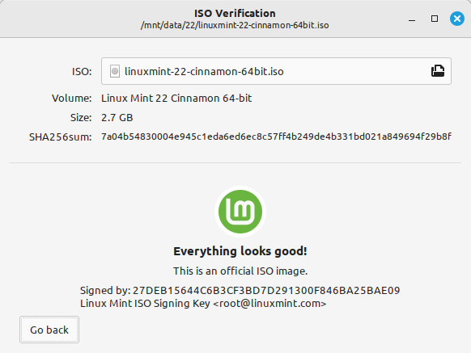

Verify your ISO image
=====================

It is important to verify the integrity and authenticity of your ISO image.

The integrity check confirms that your ISO image was properly downloaded and that your local file is an exact copy of the file present on the download servers. An error during the download could result in a corrupted file and trigger random issues during the installation.

The authenticity check confirms that the ISO image you downloaded was signed by Linux Mint, and thus that it isn't a modified or malicious copy made by somebody else.

Verify using Linux Mint
-----------------------

If you are already running Linux Mint you can use the built-in tool to perform all the verification checks. Right-click the ISO image and select `Verify`, or use the `mint-iso-verify` command with your ISO file:

.. code-block:: console

    mint-iso-verify yourfile.iso



Download the SHA256 sums provided by Linux Mint
-----------------------------------------------

All `download mirrors <https://www.linuxmint.com/mirrors.php>`_ provide the ISO images, a ``sha256sum.txt`` file and a ``sha256sum.txt.gpg`` file. You should be able to find these files in the same place you downloaded the ISO image from.

If you can't find them, browse the `Kernel.org download mirror <https://mirrors.kernel.org/linuxmint/stable/>`_ and click the version of the Linux Mint release you downloaded.

Download both ``sha256sum.txt`` and ``sha256sum.txt.gpg``.

Do not copy their content, use "right-click->Save Link As..." to download the files themselves and do not modify them in any way.

Integrity check
---------------

To check the integrity of your local ISO file, generate its SHA256 sum and compare it with the sum present in ``sha256sum.txt``.

.. code-block:: console

    sha256sum -b yourfile.iso

If you are running macOS, generate its SHA256 sum and compare it with the sum present in ``sha256sum.txt`` using the ``shasum`` command.

.. code-block:: console

    shasum -a 256 yourfile.iso

.. hint::
    If you are using Windows follow the tutorial `How to verify the ISO image on Windows <https://forums.linuxmint.com/viewtopic.php?f=42&t=291093>`_.

If the sums match, your ISO image was successfully downloaded. If they don't, download it again.

`````

Authenticity check
------------------

To verify the authenticity of ``sha256sum.txt``, check the signature of ``sha256sum.txt.gpg`` by following the steps below.

Import the Linux Mint signing key:
``````````````````````````````````
.. code-block:: console

   gpg --keyserver hkp://keys.openpgp.org:80 --recv-key 27DEB15644C6B3CF3BD7D291300F846BA25BAE09

.. note::
    Check that the key was properly imported:

    .. code-block:: console

        gpg --list-key --with-fingerprint A25BAE09

    The output should contain `27DE B156 44C6 B3CF 3BD7  D291 300F 846B A25B AE09` and look like this:

    .. code-block:: console

        pub   rsa4096 2016-06-07 [SC]
              27DE B156 44C6 B3CF 3BD7  D291 300F 846B A25B AE09
        uid           [ unknown] Linux Mint ISO Signing Key <root@linuxmint.com>


Verify the authenticity of sha256sum.txt:
`````````````````````````````````````````
.. code-block:: console

    gpg --verify sha256sum.txt.gpg sha256sum.txt

The output of the last command should tell you that the file signature is ``good`` and that it was signed with the ``27DEB15644C6B3CF3BD7D291300F846BA25BAE09`` key.

.. note::
    GPG might warn you that the Linux Mint signature is not trusted by your computer. This is expected and perfectly normal.

